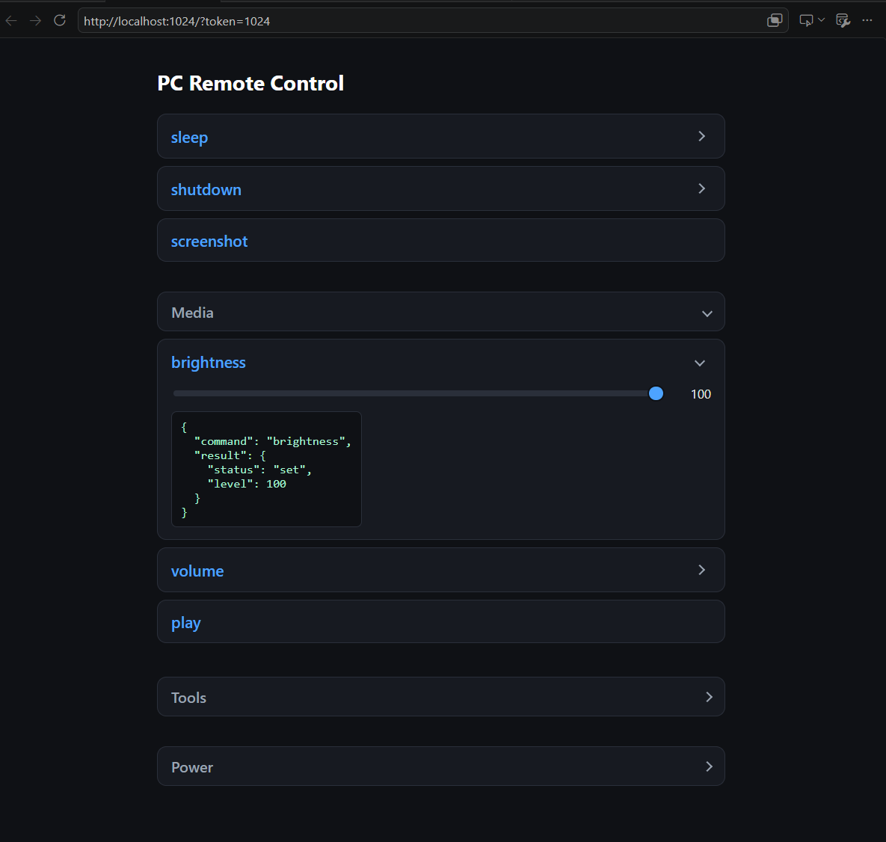
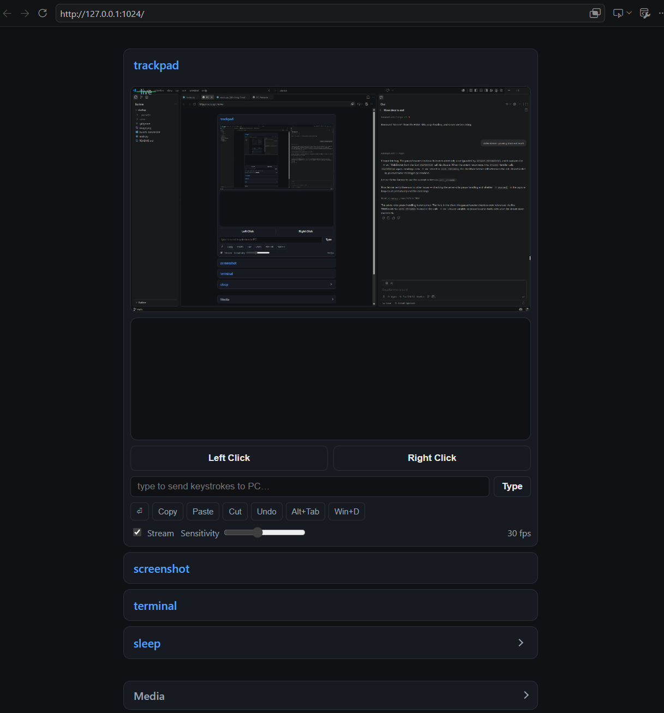

Launches Web UI on 0.0.0.0:1024 that allows anyone on same network to control the Windows PC.
I use it to turn off my PC from my phone when I'm too lazy to get up.

### How To Run
- run `launch_remote.bat`
- optionally add it to startup (see below)

### Features
- you can set `PC_API_TOKEN` environment variable to require a secret token on
  every request (prevents random devices on your network from controlling your
  PC). Set it in `launch_remote.bat` before launching, then open the UI as
  `http://<PC-IP>:1024/?token=YOUR_TOKEN`. If the token is empty, the server is
  open to anyone on your network.

### Run at Windows startup (with Administrator privileges)

Some commands (`bluetooth`, `wifi`) need the server to run elevated. The
cleanest way to auto-start it as admin at login is a **Scheduled Task** —
the Startup folder can't launch elevated scripts without a UAC prompt.

#### Option A — Scheduled Task (recommended, runs elevated, no UAC popup)

1. Open Task Scheduler: `Win+R` → `taskschd.msc` → Enter.
2. Right-click **Task Scheduler (Local)** → **Create Task…**
3. **General** tab:
   - Name: `PC Remote`
   - Tick **Run with highest privileges** (this gives it admin rights).
   - Select **Run whether user is logged on or not** if you want it to survive
     UAC lock screens, or **Run only when user is logged on** (simpler).
4. **Triggers** tab → **New…**:
   - Begin the task: **At log on**
   - Specific user: your account.
5. **Actions** tab → **New…**:
   - Action: **Start a program**
   - Program/script: browse to `launch_remote.bat` (e.g. `C:\code\startup\launch_remote.bat`)
   - Start in: the folder containing it (e.g. `C:\code\startup`)
6. **Conditions** tab: untick **Start the task only if the computer is on AC power**.
7. **Settings** tab: tick **Run task as soon as possible after a scheduled start is missed**.
8. Click **OK** (you'll be asked for your Windows password once).

To test it immediately: right-click the task → **Run**.

#### Option B — Startup folder (no admin, simpler)

Only use this if you don't need `bluetooth`/`wifi` (they require elevation).

1. `Win+R` → `shell:startup` → Enter.
2. Copy `launch_remote.bat` (or a shortcut to it) into that folder.

The server starts at next login. Open `http://<PC-IP>:1024/` from your phone. 

