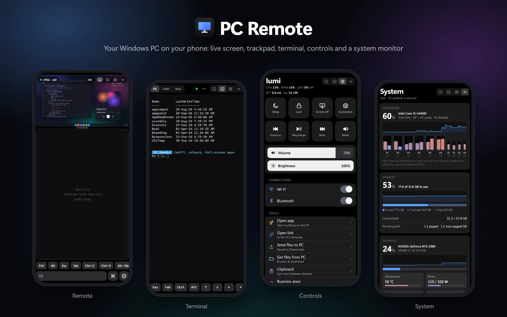
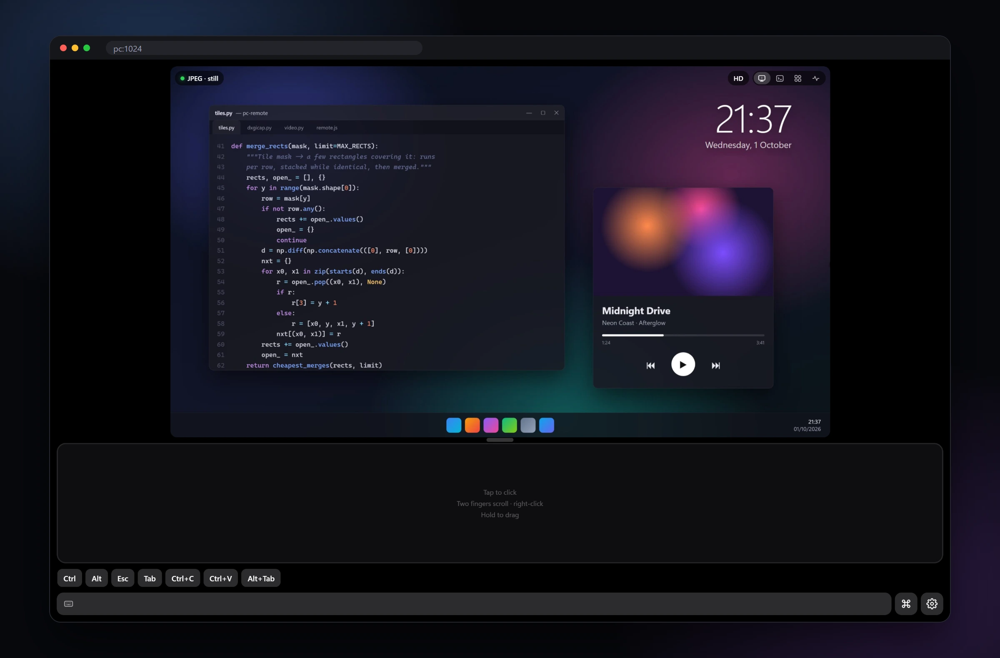
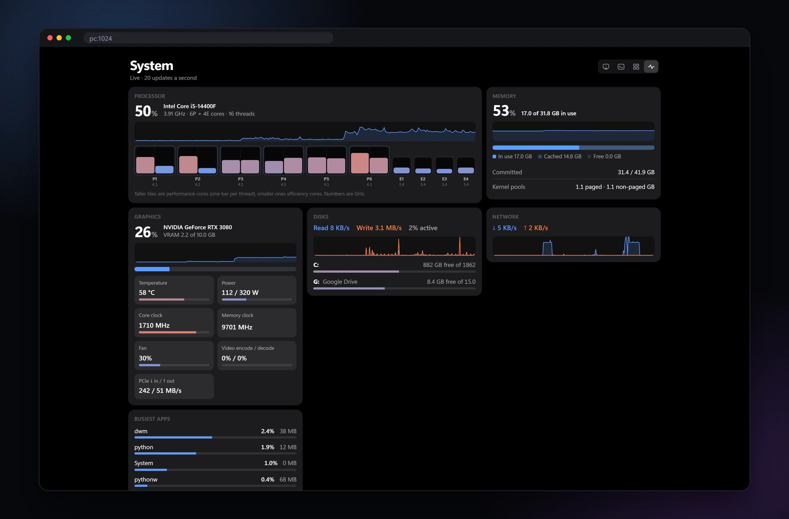

# PC Remote



Your Windows PC, from your phone's browser. No app, no account, no cloud.

- **Remote**: the live screen at up to 240 fps, 5–20 ms behind the real one. Trackpad, keyboard, pinch to zoom.
- **Terminal**: PowerShell, CMD or WSL, full color, survives reconnects.
- **Controls**: sleep, lock, media, volume, brightness, Wi-Fi, Bluetooth, open apps, send files, clipboard sync, power timers.
- **System**: every core, GPU, memory, disks and network, 20 updates a second, with a minute of history.
- **Sign-in**: scan the PC's QR code once and the phone stays signed in.




## Install

Download the **PC-Remote-Setup** installer from the [latest release](https://github.com/GeorgeAzma/pc-remote/releases/latest) and run it. Python and ffmpeg are included.

The installer isn't code-signed yet, so Windows may say "Windows protected your PC". Click **More info → Run anyway**.

When it finishes, it shows a QR code: scan it with your phone and you're in. It also:

- starts PC Remote when you sign in to Windows, with admin rights and no UAC prompt, so it can type into admin windows. Turn this off in **Controls → About → Start with Windows**. It's a Task Scheduler task, so it isn't in Task Manager's startup list;
- opens the firewall on home networks and on Tailscale only, never on public networks.

To open it on the PC later, open **PC Remote** from the Start menu: it shows the QR code again.

Away from home? Put the PC and the phone on [Tailscale](https://tailscale.com) and pick the Tailscale QR code.

Uninstalling (Settings → Apps) removes all of it, including the startup task, the firewall rules and the settings.

## Sign-in

Sign-in is **on** by default. A new device signs in once by scanning the PC's QR code, with the phone's camera or with **Scan the QR code** in the app, or by entering the access code. The PC itself never has to sign in; WSL, containers and tunnels running on it do.

A signed-in device stays signed in: nothing expires. Its key is kept in the browser and in a cookie, so either one alone is enough. Each address (local network, Tailscale, `http` or `https`) signs in separately. Anyone with the QR code or link can sign in, so treat it like a password.

Manage it in **Controls → About → Sign-in & devices**, where you can:

- add a device with a QR code;
- use your own password instead of the code;
- sign out every other device;
- turn sign-in off, if your network is already private (Tailscale, say). This setting is saved.

Either way, websites you visit can't reach the server through your browser: it blocks cross-site requests and DNS rebinding.

## HD stream

Over `http://` the stream is tiled JPEG, which sends only the parts of the screen that changed. Over `https://` you also get H.264 or HEVC through WebCodecs, which uses far less bandwidth for full-screen video. Tap **HD** on the screen. To get rid of the certificate warning, **Controls → About → Secure connection** shows how to trust the certificate on each platform.

## How it's fast

- **Tiled JPEG**: DXGI desktop duplication, a GPU downscale, and only the changed 32×32 tiles are sent. Still areas are resent sharper.
- **H.264 / HEVC**: NVENC with zero copies, no B-frames, and a frame is sent the moment it's encoded. It falls back to QSV, AMF or x264 on other GPUs.
- **Rate control**: every frame is acknowledged. The bitrate follows the link at about 75% of its capacity, so nothing queues. Quality and resolution changes swap encoders without a pause.
- **The cursor** is drawn on the phone and moves as soon as your finger does.

## From source

```bat
winget install Gyan.FFmpeg
python -m venv .venv
.venv\Scripts\pip install -r requirements.txt
launch_remote.bat
```

## Build the installer

```bat
.venv\Scripts\pip install pyinstaller
winget install JRSoftware.InnoSetup
.venv\Scripts\python packaging\build.py
```

The installer lands in `dist\`. Pushing a `v*` tag builds it on GitHub and attaches it to a release.

## Code signing policy

Free code signing provided by [SignPath.io](https://about.signpath.io), certificate by [SignPath Foundation](https://signpath.org).

- Committers and reviewers: [GeorgeAzma](https://github.com/GeorgeAzma)
- Approvers: [GeorgeAzma](https://github.com/GeorgeAzma)

Only `PC Remote.exe` and the installer are signed, and they're built by [this workflow](.github/workflows/release.yml) from this repository. Setup steps are in [docs/SIGNING.md](docs/SIGNING.md).

**Privacy:** this program will not transfer any information to other networked systems unless specifically requested by the user or the person installing or operating it. It only answers devices that connect to it. It has no telemetry and makes no connections of its own.

## Add a command

```python
@command("say", "Speak text on the PC.", tab="tools", icon="volume")
def say(text: str = ""):
    ...
```

This becomes `GET/POST /say?text=…` and a button in the app.

## License

MIT, see [LICENSE](LICENSE). The installer also bundles Python, FFmpeg (LGPL) and a few libraries under their own licences: see [THIRD-PARTY-NOTICES.md](THIRD-PARTY-NOTICES.md).
